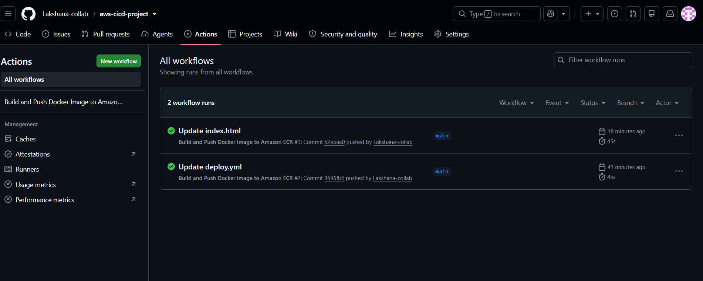
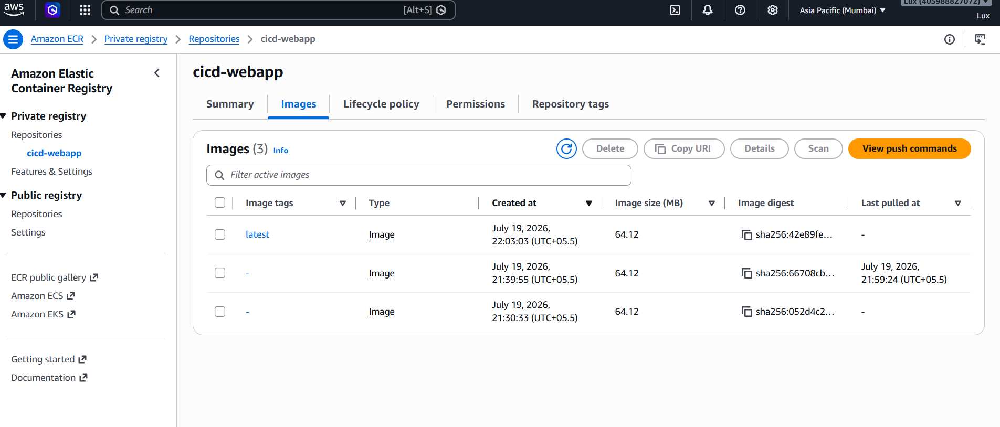
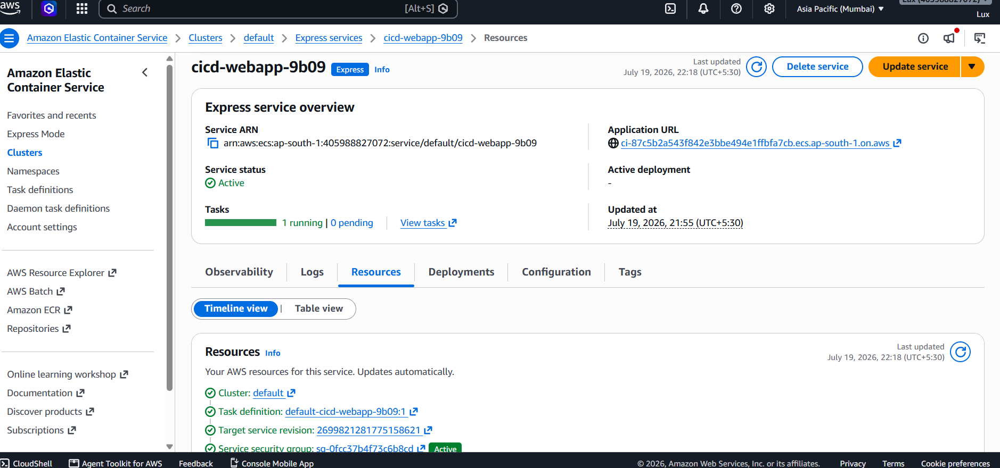
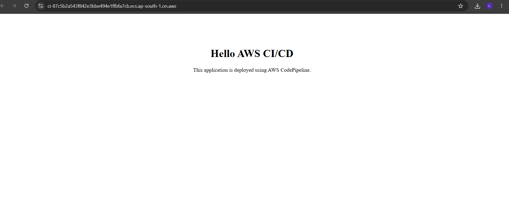

# 🚀 Automated CI/CD Pipeline using GitHub Actions & AWS

This project demonstrates an end-to-end CI/CD pipeline that automatically builds, pushes, and deploys a Dockerized web application using GitHub Actions and AWS.

## 📌 Project Overview

Whenever code is pushed to the `main` branch:

1. GitHub Actions is triggered automatically.
2. A Docker image is built.
3. The image is pushed to Amazon Elastic Container Registry (ECR).
4. Amazon ECS Express deploys the latest image.
5. The updated application becomes available online.

---

## 🏗️ Architecture

```text
Developer
    │
    ▼
GitHub Repository
    │
    ▼
GitHub Actions
    │
    ▼
Docker Build
    │
    ▼
Amazon ECR
    │
    ▼
Amazon ECS Express
    │
    ▼
Live Web Application
```

---

## 🛠️ Tech Stack

- Git
- GitHub
- GitHub Actions
- Docker
- Amazon ECR
- Amazon ECS Express
- AWS IAM
- HTML

---

## ⚙️ Workflow

- Push code to GitHub
- GitHub Actions starts automatically
- Docker image is created
- Docker image is pushed to Amazon ECR
- Amazon ECS Express deploys the latest image

---

## 📁 Project Files

```
.
├── .github/
│   └── workflows/
│       └── deploy.yml
├── Dockerfile
├── index.html
└── README.md
```

---

## 📷 Project Screenshots

### GitHub Actions



### Amazon ECR



### Amazon ECS Express



### Live Application



---

## 🚀 Features

- Automated CI/CD pipeline
- Docker containerization
- Secure authentication using IAM and GitHub Secrets
- Automatic deployments
- Cloud-based deployment on AWS

---

## 👨‍💻 Author

**Lakshana V**

GitHub: https://github.com/Lakshana-collab
